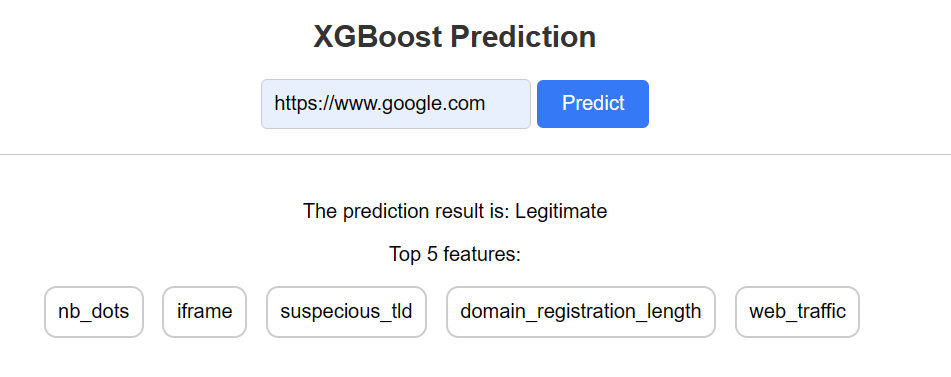

# Phishing Detection Website

## Overview
This project presents a lightweight, demo-centric phishing detection website designed to showcase the capabilities of a machine learning model in identifying phishing URLs. Users can input URLs to evaluate, and the system will provide predictive results along with the features influencing those predictions.

## Features
- **URL Submission:** Users can enter any URL they wish to check for phishing risks.
- **Progress Indicator:** A walking man animation appears to indicate that the process is running.
- **Results Display:** After the analysis, the prediction results and the key features influencing the decision are displayed on the website.

## Screenshots

### Home Page


### Predicting State


### Results Page
#### Legitimate Site


#### Phishing Site


## Technologies
- **Frontend:** HTML, CSS, JavaScript
- **Backend:** Python, Flask
- **Machine Learning Model:** Python, Scikit-Learn, XGBoost

## Installation

To get this project running on your local machine, follow these steps:

1. Clone the repository:
```git clone https://github.com/yourusername/phishing-detection-website.git```

2. Navigate to the project directory:
```cd phishingflask```

3. Install the necessary dependencies:
```pip install -r requirements.txt```

4. Run the application:
`flask run`

5. Open your web browser and visit `http://127.0.0.1:5000/` to use the application.

## Usage

To use the website:
1. Enter the URL you want to analyze in the input field on the index page.
2. Click the **Predict** button to submit the URL for analysis.
3. View the results and the explanation of the prediction on the results page once the analysis is complete.


